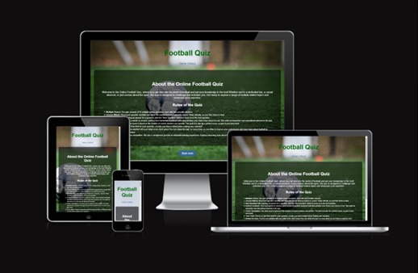

# Football Quiz
(Developer: Jamie Hughes)

 and credit
Live Webpage (as a link to site)

## Contents
1. [Introduction](#introduction)
2. [Project Goals](#project-goals)
   - [Users Goals](#users-goals)
   - [Site Owner Goals](#site-owner-goals)
3. [User Experience](#user-experience)
   - [Strategy](#strategy)
     - [Target Audience](#target-audience)
     - [User Requirements and Expectations](#user-requirements-and-expectations)
4. [Features](#features)
5. [Technologies Used](#technologies-used)
   - [Languages](#languages)
   - [Helpful Sites](#helpful-sites)
6. [Usage](#usage)
7. [Quiz Layout](#quiz-layout)
8. [Testing](#testing)
   - [Overview](#overview)
   - [Feature Testing](#feature-testing)
   - [Cross-Browser Compatibility](#cross-browser-compatibility)
   - [Validator Testing](#validator-testing)
9. [Unfixed Bugs](#unfixed-bugs)
10. [Deployment](#deployment)
11. [Credits](#credits)
	- [Media](#media)

Please note that the content is organized according to the headings and subheadings in the provided README.md file. You can use these links to easily navigate to different sections of the document.

## Introduction

The Football Quiz is a multiple choice online quiz testing the users knowledge on world football past and present.

## Project Goals

- Users Goals
	-    The site's user wants to play an online quiz to test their overall football knowledge.
- Site Owner Goals
	-    The site owner's goal is to provided an entertaining and appropriately challenging quiz to the online user.

## User Experience
### Strategy
#### Target Audience
-   Users with an interest in football.
-   Users looking for entertaining content online.

#### User Requirements and Expectations

-   Simple and intuitive navigation system.
-   Links work as expected.
-   Immediate feedback on progress.
-   Visually appealing responsive design.
-   Accessibility.

## Features

-   10 multiple-choice questions.
-   4 answers to choose from on each question, 1 correct and 3 incorrect.
-   Instant feedback on answer selection.
-   Final score and feedback displayed at the end of the quiz.
-   Responsive design for seamless use on both desktop and mobile devices.

## Technologies Used
### Languages
-   HTML: Structuring the content and layout of the application.
-   CSS: Styling the user interface to make it visually appealing and responsive.
-   JavaScript: Adding interactivity to the quiz, checking answers, and providing feedback.
### Helpful Sites
www.w3schools.com was helpful for initial brainstorming and design ideas.
https://developer.mozilla.org/en-US/ was another helpful site for general layout and standard practise of writing code.

## Usage

1.  Start the quiz by clicking the "Begin Quiz" button on the home page.
2.  Read each question carefully and select the answer you believe is correct.
3.  After selecting an answer, click the "Next" button to proceed to the next question.
4.  Your score and feedback for each question will be displayed immediately.
5.  Once you've answered all 10 questions, your final score and overall feedback will be shown.
6.  To retake the quiz, simply refresh the page.

## Quiz Layout

- The Home page is the initial landing page for the quiz displays a football background image with a short paragraph explaining the use of the quiz. This includes a start quiz button below for easy navigation directly to the quiz.
- The About page includes simple broken down instructions of how to take the quiz.

## Testing
### Overview

In the development of our project, we have thoroughly tested each feature to ensure that the site functions as intended and provides an optimal user experience. Our testing approach covered various aspects, including feature testing, cross-browser compatibility, and responsiveness on different screen sizes.

### Feature Testing

We conducted comprehensive feature testing to verify the functionality of each component of our project. Here are some key features we tested and confirmed to be working seamlessly:
    
-   **Navigation:** The navigation menu and links were tested to confirm that users can easily move between different sections of the site without encountering broken links or unexpected behaviour.
-  **Multiple-Choice Button:** We tested the multiple-choice buttons. For every question presented to the user, we confirmed the following:
	-	Each answer choice accurately represents the options provided.
	-	Users can select a single answer choice for each question.
	-	Users cannot select more than one answer choice simultaneously.
	-	The selected answer is visually highlighted for clarity and once clicked the users cannot change their answer for that specific question.
	
- **Score Tracking Validation:** We have thoroughly validated the score tracking mechanism within our application. Our testing included:
	- Answering questions correctly and ensuring that the score increments accurately.
	- Answering questions incorrectly and confirming that the score remains unchanged or decrements as expected.
	- Navigating through different sections of the application and verifying that the score remains consistent.    

### Cross-Browser Compatibility

We took extra care to ensure our project works consistently across different web browsers. Our testing included the following browsers:

-   Google Chrome
-   Mozilla Firefox
-   Microsoft Edge
-   Safari

## Validator Testing
- HTML
	- No errors were returned when passing through the official W3C validator
- CSS
	- No errors were found when passing through the official (Jigsaw) validator
- Java Script
	- No errors were found when passing through a linter (JSHint)

## Unfixed Bugs

## Deployment
- The Site was deployed to GitHub pages. The steps to deploy are as follows:
	- In the GitHub repository, navigate to the Settings tab
	- From the source section drop-down menu, select the Main Branch
	- Once the main branch has been selected, the page will be automatically refreshed with a detailed ribbon display to indicate the successful deployment.
	
	The live link can be found here - ...

## Credits
- The application was developed by Jamie Hughes.
- The functionality for keeping track of the score was inspired by the Love Maths project.

### Media
- The background image throughout quiz home and about pages are from...
